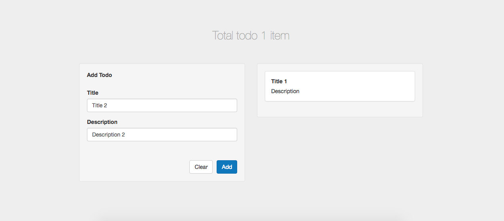

<h3>TodoList with relay</h3>
<pre>    After I tried Relay, That I thought Relay's good choice for new project with React and GraphQL
  But your project use Redux and you interesting GraphQL I think Apollo's good choice.
</pre>
 
<h4>Screen</h4>

<pre> You can add by form left side and delete by click the card of todo.
</pre>

<h4>Requirement</h4>
<pre>
  node.js (recommend v6.6.0)
  npm (recommend v3.10.8)
  mongodb
</pre>

<h4>Dependency</h4>
<pre>
  babel
  express
  graphql
  mongoose
  react
  relay
</pre>

<h4>Start</h4>
<pre>
  // install all dependency
  npm i
  // start
  npm run start
  // start with development
  npm run dev
</pre>
<pre>
  Now you can view todo list at http://localhost:3000
  And try to query at `http://localhost:3000/graphql`
</pre>

<h4>Test</h4>
<pre>
  // run simple test case for graphql server
  npm run test
</pre>

<h4>Query</h4>
<u>example</u>
<pre>
  query {
  	viewer {
      todo (title: "title") {
        edges {
          node {
            id
            title
            description
          }
        }
      }
      todos {
        edges {
          node {
            id
            title
            description
          }
        }
      }
    }
  }
</pre>

<h4>Mutation</h4>
<u>example</u>
<pre>
  mutation {
    createTodo(input: {title: "Title 1", description: "Description 1"}) {
      todoEdge {
        node {
          id
          title
          description
        }
      }
      viewer {
        todos {
          edges {
            node {
              id
              title
              description
            }
          }
        }
      }
    }
    deleteTodo(input: {todoID: "VG9kbzo1ODI3M2VjODVkMTE5MDYyZjdmNWQ1YjY="}) {
      viewer {
        todos {
          edges {
            node {
              id
              title
              description
            }
          }
        }
      }
    }
  }
</pre>

<pre>Thank
  https://github.com/lvarayut/relay-fullstack
  http://learnrelay.org/
  https://facebook.github.io/relay/
This project for learn.</pre>
