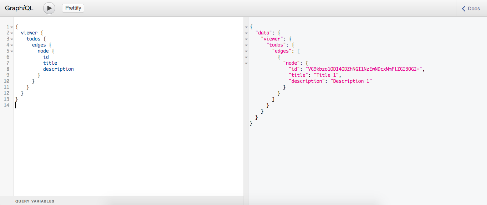

<h2>Test Case</h2>
<h3>Test by script</h3>
    You can test by script, That have 3 test case by 
  1) Test about insert todo 
  2) Test about search todo by todo's title same test case 1 
  3) Test about delete todo's create by todo in test case 1 
<h4>Run script test</h4>
<pre>
    // You will run server first
    npm run start
    or
    npm run dev
    // After started you can test by
    npm run test
</pre>
 
<h3>Manual test</h3>
    If you want to manual test. That you will start server first.
<pre>
    npm run dev
</pre>
  Then you can open GraphQL tool by
<pre>
    http://localhost:3000/graphql
    or
    http://localhost:8000
</pre>
  Then you will push query in left side.

<h4>Query all todos</h4>
  It will show all todos.
<pre>
    query {
      viewer {
        todos {
          edges {
            node {
              id
              title
              description
            }
          }
        }
      }
    }
</pre>
<h4>Query todos by title</h4>
  It will show todos are same "title".
<pre>
    query {
      viewer {
        todo (title: "title") {
          edges {
            node {
              id
              title
              description
            }
          }
        }
      }
    }
</pre>
<h4>Mutation create new todo</h4>
  You can create new todo by title and description, Then it will return 
  todoEdge's todo of inserted todo and viewer's same viewer in query.
<pre>
  mutation {
    createTodo(input: {title: "Title 1", description: "Description 1"}) {
      todoEdge {
        node {
          id
          title
          description
        }
      }
      viewer {
        todos {
          edges {
            node {
              id
              title
              description
            }
          }
        }
      }
    }
  }
</pre>
<h4>Mutation delete todo</h4>
  You can delete todo by todoID, It's id of todo.
<pre>
  mutation {
    deleteTodo(input: {todoID: "VG9kbzo1ODI3M2VjODVkMTE5MDYyZjdmNWQ1YjY="}) {
      viewer {
        todos {
          edges {
            node {
              id
              title
              description
            }
          }
        }
      }
    }
  }
</pre>
